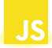
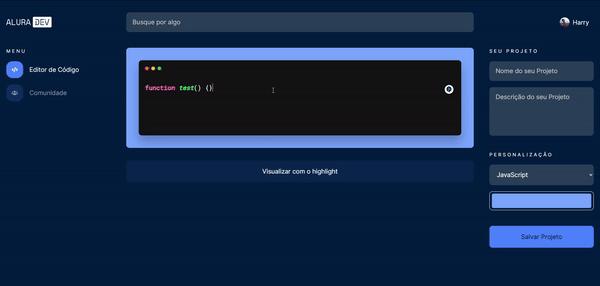
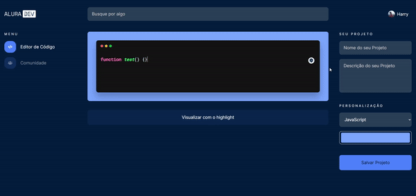

# Code Canvas 🎫

Projeto web para edição e compartilhamento de código no site, com sintaxe *Highlight* de acordo com a linguagem especificada.

<hr>

## Tecnologias Usadas 🖥




## Como Executar o Projeto ▶

Clone o projeto com o comando:
```bash
git clone https://github.com/Volaxy/aluradev.git
```

em seguida, entre na pasta e abra o arquivo ***index.html*** no navegador de sua preferência.

## Utilização do Editor 🖐

* Na página **Editor de Código**, clique na tela preta e comece a digitar o seu código.

* Para aplicar a sintaxe highlight, selecione a linguagem na *combobox* do lado direito, e clique em **Visualizar com Hightlight**.
> ⚠ Observações:
> * Por padrão a linguagem selecionada é o JavaScript
> * Para aplicar o efeito de highlight depois de digitar é preciso clicar no botão **Visualizar com Hightlight**.



* Todos os projetos criado estarão na página **Comunidade**.



## Link 🔗

[Alura Dev](https://aluradev-opal.vercel.app/) (**Vercel**) 🔗

## Aprendizado do Projeto 🎓

Apliquei os conceitos do **JavaScript** no projeto, além de deixar o site totalmente responsivo para qualquer dispositivo, organizando o código em pedaços para fácil manutenção e implementação de novas features.

## Licença ✒

[Unlicense](https://unlicense.org) 🔗